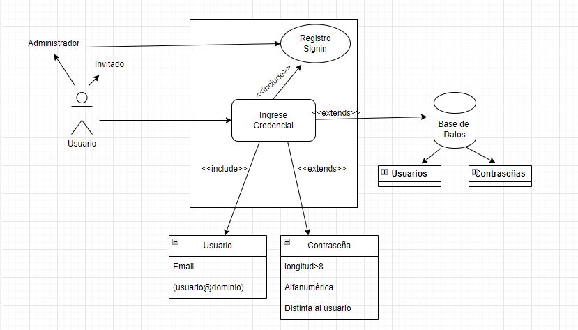

# Inicio de sesión
Un simple inicio de sesión para administradores e invitados de un sistema

## Casos de uso 


---

### Nombre del caso de uso:
Inicio de sesión como administrador

---

### Precondición: 
El administrador existe en el sistema.

---

### Poscondición: 
El administrador ingresa con éxito.

---

### Flujo principal:
  1. El sistema solicita el tipo de usuario.
  2. Usuario ingresa "admin".
  3. El sistema solicita un e-mail.
  4. Usuario ingresa un e-mail.
  5. El sistema verifica que el e-mail sea válido.
  6. El sistema solicita una contraseña.
  7. El usuario ingresa una contraseña.
  8. El sistema verifica la contraseña.
  9. Inicio de sesión exitoso.
  10. Fin del caso de uso.

---

### Flujo alternativo A:
  5.1 El e-mail que ingresó el usuario no es válido y el sistema emite un error.  
  6. Fin del caso de uso
  
---

### Flujo alternativo B:
  8.1 La contraseña que ingresó el usuario no es válida y el sistema emite un error.  
  9. Fin del caso de uso
  
---
---

### Nombre del caso de uso:
Inicio de sesión como invitado

---

### Precondición: 
Ninguna

---

### Poscondición: 
El invitado ingresa con éxito.

---

### Flujo principal:
  1. El sistema solicita el tipo de usuario.
  2. Usuario ingresa "invitado".
  3. El sistema solicita un e-mail.
  4. Usuario ingresa un e-mail.
  5. El sistema verifica que el e-mail sea válido.
  6. Inicio de sesión exitoso.
  7. Fin del caso de uso.

---

### Flujo alternativo:
  5.1 El e-mail que ingresó el usuario no es válido y el sistema emite un error.  
  6. Fin del caso de uso
  
---
---


## Muestra de código

### Clase Usuario
```C#
using System;
using System.Collections.Generic;
using System.Linq;
using System.Net.Mail;
using System.Security.Cryptography.X509Certificates;
using System.Text;
using System.Threading.Tasks;

namespace GestionTrabajo1
{
    class Usuario
    {
        public Usuario() { 
            
        }
        public Usuario(string email)
        {
            Email = email;
        }
        public string Email { get; set; }
        public bool ComprobadorDeContrasenia(string contrasenia) {
            if (contrasenia.Length > 8)
            {
                if (ComprobarAlfaNum(contrasenia)) {
                    MailAddress mailAddress = new MailAddress(Email);
                    if (!contrasenia.Equals(mailAddress.User))
                    {
                        return true;
                    }
                }

            }  
            return false;
        }
        public bool ComprobarAlfaNum(string contrasenia)
        {
             foreach(char c in contrasenia)
            {
                if (!char.IsLetterOrDigit(c))
                {
                    return false;
                }
            }
             return true;
        }

    }
}
```

### Programa principal
```C#
using GestionTrabajo1;
using System.Net.Mail;
using System.Reflection.Metadata;

static bool verificadorEmail(string email)
{
    try
    {
        MailAddress mail = new MailAddress(email);
        return true;
    }
    catch (Exception e)
    {
        return false;
    }
}

List<Usuario> usuarios = new List<Usuario>
{
    new Usuario("wentenviere0@gmail.com"),
    new Usuario("wentenviere32151@gmail.com")
};

Console.WriteLine("INICIO DE SESIÓN");
Console.WriteLine("¿Quiere iniciar sesión como Invitado o como Admin?");
string op = Console.ReadLine();
switch (op)
{
    case "Invitado" or "invitado":
        Console.Clear();
        Console.WriteLine("INICIO DE SESIÓN");
        Console.WriteLine("Ingrese su e-mail para iniciar sesión");
        string mail = Console.ReadLine();
        if (verificadorEmail(mail))
        {
            Console.WriteLine("Iniciaste sesión como invitado correctamente");
        }
        else
        {
            Console.WriteLine("El e-mail no es válido");
        }

        break;
    case "Admin" or "admin":
        Console.Clear();
        Console.WriteLine("INICIO DE SESIÓN");
        Console.WriteLine("Ingrese su e-mail: ");
        string mail1 = Console.ReadLine();
        if (verificadorEmail(mail1))//comprobamos que el email es correcto
        {
            bool comprobador = false;
            Usuario user = new Usuario();
            foreach (Usuario usuario in usuarios)
            {
                if (usuario.Email == mail1)
                {
                   comprobador=true;
                   user = usuario;
                }
            }

            if (comprobador == true)
            {
                Console.WriteLine("Ingrese contraseña: ");
                string cont = Console.ReadLine();
                if (user.ComprobadorDeContrasenia(cont))
                {
                    Console.WriteLine("Ingresó correctamente");
                }
                else
                {
                    Console.WriteLine("La contraseña es inválida");
                }
            }
            else
            {
                Console.WriteLine("No se encontró el usuario");
            }
        }
        else
        {
            Console.WriteLine("El e-mail no es válido");
        }
        break;

    default:
        Console.WriteLine("Ingrese una opción válida");
        break;
}
```

## Analicemos esto

### Clase Usuario
Empecemos por la clase Usuario

---

### El usuario
```C#
 public Usuario(string email)
        {
            Email = email;
        }
```
Creamos una clase sólo para el usuario con el propósito de facilitar su gestión y la comprobación de sus credenciales (E-Mail y contraseña).

"Usuario" es un objeto con un único atributo: su mail. Al existir usuarios invitados, no es necesario asignarle también una contraseña.

### Los métodos del objeto Usuario
La clase "Usuario" tiene tres métodos: Los Getter/Setter, un verificador de caracteres alfanuméricos y finalmente un verificador de contraseñas.

```C#
public string Email { get; set; }

public bool ComprobadorDeContrasenia(string contrasenia) {
    ...
}

public bool ComprobarAlfaNum(string contrasenia)
{
    ...
}
```
Como mencionamos antes, se hicieron con la intención de gestionar al objeto "Usuario". Los Getter/Setter son para definir al objeto y los otros dos métodos los utilizamos
para corroborar diferentes aspectos de la contraseña y así verificar si es válida o no. Los parámetros que elegimos para una contraseña válida fueron los siguientes:
- Longitud mayor a 8 caracteres
- Sólo caracteres alfanuméricos
- Contraseña diferente al usuario

---

### Programa principal
Ahora explicaremos el flujo del programa principal.


### Lista de usuarios

```C#
List<Usuario> usuarios = new List<Usuario>
{
    new Usuario("wentenviere0@gmail.com"),
    new Usuario("wentenviere32151@gmail.com")
};
```

Los e-mail de los administradores son definidos en una lista al inicio de la ejecución. Sólo estos e-mail son válidos para el ingreso como administrador.

### Solicitud de información

```C#
static bool verificadorEmail(string email)
{
    try
    {
        MailAddress mail = new MailAddress(email);
        return true;
    }
    catch (Exception e)
    {
        return false;
    }
}

Console.WriteLine("INICIO DE SESIÓN");
Console.WriteLine("¿Quiere iniciar sesión como Invitado o como Admin?");
string op = Console.ReadLine();
switch (op)
{
    case "Invitado" or "invitado":
        ...
        break;
    case "Admin" or "admin":
       ...
        break;

    default:
        Console.WriteLine("Ingrese una opción válida");
        break;
}
```
Le pedimos al usuario que elija entre ingresar como Admin o Invitado. El switch nos facilita la escritura de código para cada usuario, además de que nos permite agregar un caso 
por si no se escribió correctamente lo solicitado.

El método "verificadorEmail" nos servirá más adelante, pero compara el e-mail ingresado con un objeto de tipo Mail. Nos permite saber si es una dirección válida.

### Caso 1: invitado

```C#
case "Invitado" or "invitado":
        Console.Clear();
        Console.WriteLine("INICIO DE SESIÓN");
        Console.WriteLine("Ingrese su e-mail para iniciar sesión");
        string mail = Console.ReadLine();
        if (verificadorEmail(mail))
        {
            Console.WriteLine("Iniciaste sesión como invitado correctamente");
        }
        else
        {
            Console.WriteLine("El e-mail no es válido");
        }

        break;
```

El invitado es el usuario sin contraseña y poco acceso a un futuro sistema. Como tal, sólo tenemos que solicitar un e-mail, verificarlo y si es válido, le damos acceso. En el caso
contrario, le negamos el acceso.

### Caso 2: Admin

```C#
case "Admin" or "admin":
        Console.Clear();
        Console.WriteLine("INICIO DE SESIÓN");
        Console.WriteLine("Ingrese su e-mail: ");
        string mail1 = Console.ReadLine();
        if (verificadorEmail(mail1))//comprobamos que el email es correcto
        {
            bool comprobador = false;
            Usuario user = new Usuario();
            foreach (Usuario usuario in usuarios)
            {
                if (usuario.Email == mail1)
                {
                   comprobador=true;
                   user = usuario;
                }
            }

            if (comprobador == true)
            {
                Console.WriteLine("Ingrese contraseña: ");
                string cont = Console.ReadLine();
                if (user.ComprobadorDeContrasenia(cont))
                {
                    Console.WriteLine("Ingresó correctamente");
                }
                else
                {
                    Console.WriteLine("La contraseña es inválida");
                }
            }
            else
            {
                Console.WriteLine("No se encontró el usuario");
            }
        }
        else
        {
            Console.WriteLine("El e-mail no es válido");
        }
        break;
```

El administrador va a tener mayores permisos a un futuro sistema. Nosotros le exigimos para mayor seguridad una contraseña con características ya mencionadas.
El código es muy similar; Sólo hay que verificar la contraseña.

```C#
if (comprobador == true)
{
    Console.WriteLine("Ingrese contraseña: ");
    string cont = Console.ReadLine();
    if (user.ComprobadorDeContrasenia(cont))
    {
        Console.WriteLine("Ingresó correctamente");
    }
    else
    {
        Console.WriteLine("La contraseña es inválida");
    }
}
else
{
    Console.WriteLine("No se encontró el usuario");
}
```


## Referencias
Clase "MailAddress"
https://learn.microsoft.com/en-us/dotnet/api/system.net.mail.mailaddress?view=net-8.0


## Contribuidores 
- Federico González
- Máximo Castro
- Santiago Hornos
- Wenten Viere
